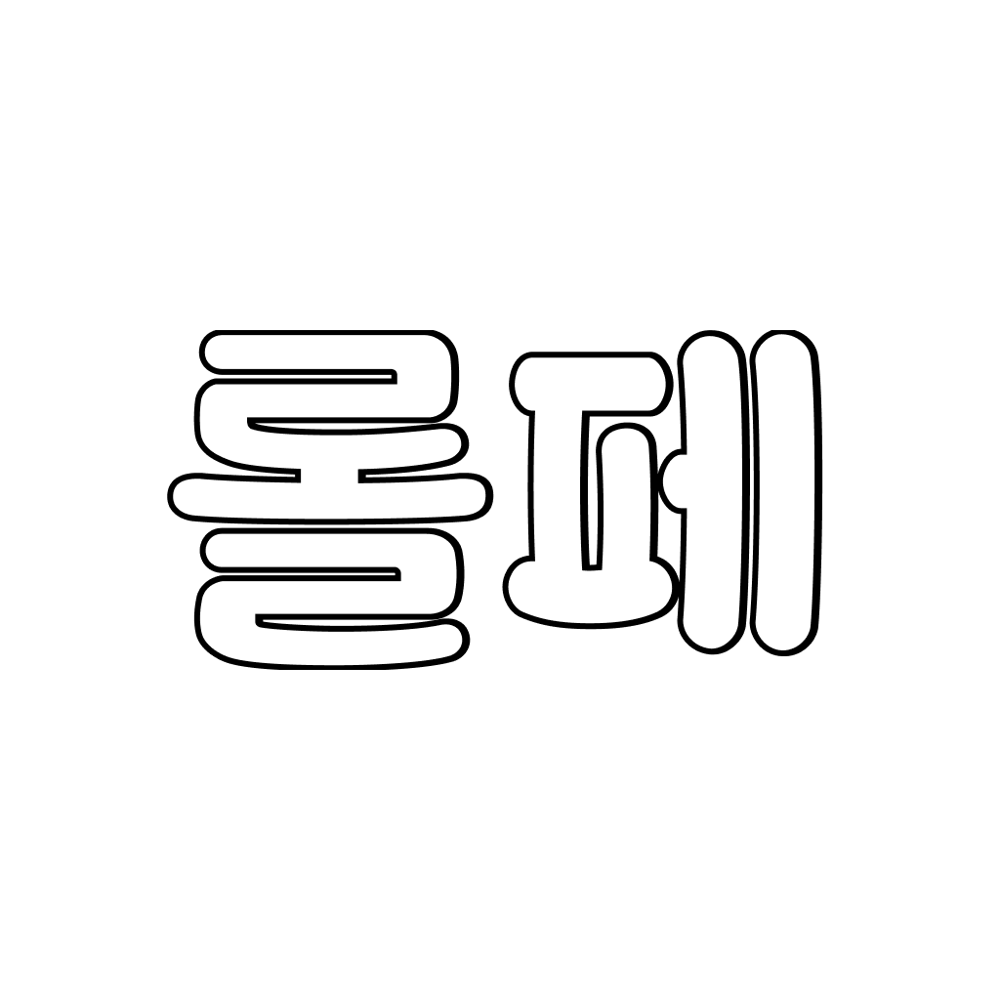
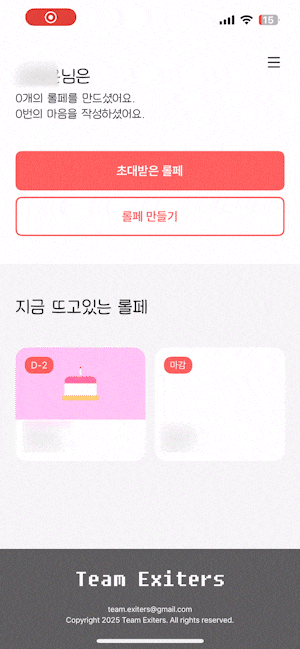
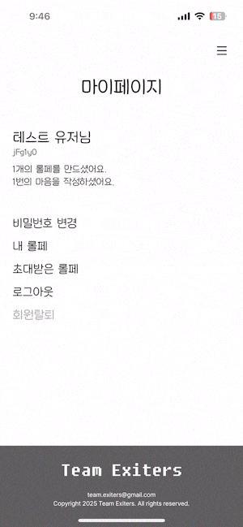

<h1 align="center">
  롤페
</h1>

  
   
   
  다같이 한 마음으로 사랑하는 사람에게 전달해보세요.

 

  
   
  Only available in South Korea

## 소개

더 이상 종이와 펜을 사용하지 마세요! '롤페' 앱 하나면 언제 어디서든 롤링페이퍼를 만들어 전달할 수 있습니다! 
친구의 생일, 직장 동료의 송별회, 스승의 날 감사 인사, 졸업, 결혼 등 특별한 날 
지금 바로 '롤페'를 다운로드하고 사랑하는 사람에게 마음을 전달하세요! 
 
 
[롤페 사용법] 
 

  1. 롤페 만들기: 제목, 테마, 마감일, 수신자를 설정하여 롤페를 만드세요. 
  2. 공유하기: 롤페를 공유하여 사람들을 초대하세요. 
  3. 마음 남기기: 메모지를 눌러 마음을 남기세요. 
  4. 전달하기: 마감일이 지나면 수신자에게 자동으로 전달이 돼요. 이미지로도 저장할 수 있어요! 

 
 

## 기능

<table>
  <tr>
    <td align="center">
      
    </td>
  </tr>
  <tr>
    <td align="center"><b>롤페 만들기</b></td>
  </tr>
</table>

<table>
  <tr>
    <td align="center">
      
    </td>
  </tr>
  <tr>
    <td align="center"><b>검색 후 입장</b></td>
  </tr>
</table>

<table>
  <tr>
    <td align="center">
      
    </td>
  </tr>
  <tr>
    <td align="center"><b>마음 남기기</b></td>
  </tr>
</table>

<table>
  <tr>
    <td align="center">
      
    </td>
  </tr>
  <tr>
    <td align="center"><b>롤페 마감 후 이미지 저장</b></td>
  </tr>
</table>

## 기여자

<table>
  <tr>
    <td align="center">
      
    </td>
    <td align="center">
      
    </td>
  </tr>
  <tr>
    <td align="center">
      <a href="https://github.com/hugesilver">hugesilver</a>
    </td>
    <td align="center">
      <a href="https://github.com/">MONGSEALE</a>
    </td>
</table>

## 기술 스택

    

## 외부 패키지

- [GoogleSignIn](https://github.com/google/GoogleSignIn-iOS)
- [RxKakaoOpenSDK](https://github.com/kakao/kakao-ios-sdk-rx)
- [MarqueeLabel](https://github.com/cbpowell/MarqueeLabel)
- [RxGesture](https://github.com/RxSwiftCommunity/RxGesture)
- [RxSwift](https://github.com/ReactiveX/RxSwift)
- [SnapKit](https://github.com/SnapKit/SnapKit)
